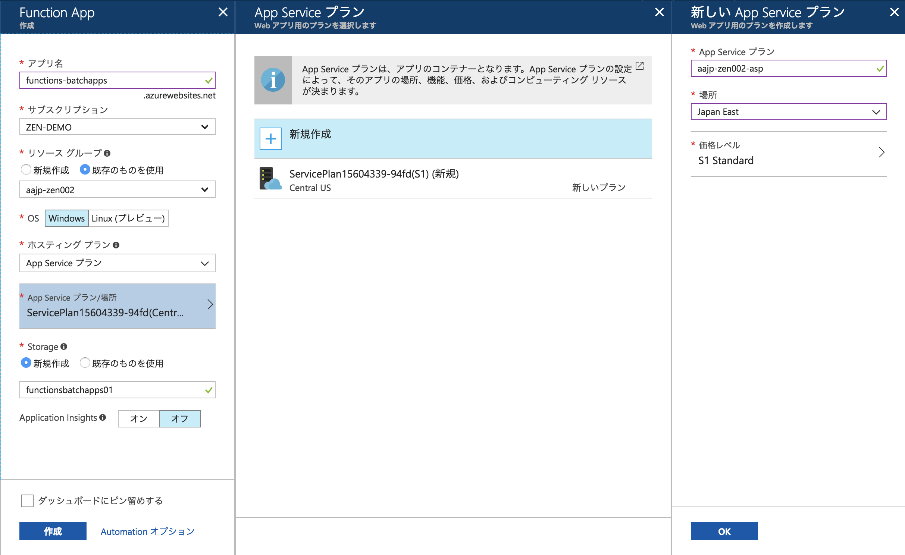

# Module01: Function Appとストレージアカウントの作成

## 1. ストレージアカウントの作成

1. Azureポータルにて、 **+リソースの作成** > **Storage** > **ストレージアカウント** をクリックします。

1. **ストレージアカウントの作成** 画面では以下を参考に設定して下さい。

    * 名前: 任意の文字列（半角英数小文字のみ, 記号不可）
    * デプロイモデル: **Resource Manager**
    * アカウントの種類: **汎用**(V1 or V2)
    * 場所: 東日本か西日本（選択できなければ他の場所、できればリソースグループの場所と同一にする）
    * レプリケーション: **ローカル冗長ストレージ（LRS)**
    * パフォーマンス: **Standard**
    * アクセス層(規定): **ホット**
    * 安全な転送が必須: **無効**
    * サブスクリプション: ハンズオン用に用意したサブスクリプション
    * リソースグループ: [module00](module00.md)で作成したリソースグループを選択（新規作成しない）
    * 仮想ネットワーク: **無効**

    **作成** をクリックします。

1. デプロイが完了するまで数分待ちます。

    画面右上の通知領域でデプロイ状況がわかりますので、ストレージアカウントが作成できたことを確認します。

## 2. Function Appの作成

1. Azureポータルにて、 **+リソースの作成** > **Compute** > **Function App** をクリックします。

1. **新規アカウント** 作成画面では以下を参考に設定して下さい。

    * アプリ名: 任意の文字列（半角英数小文字とハイフンのみ）
    * サブスクリプション: ハンズオン用に用意したサブスクリプション
    * リソースグループ: [module0](module0.md)で作成したリソースグループを選択（新規作成しない）
    * OS: **Windows**
    * ホスティングプラン: **App Service プラン**
    * App Service プラン/場所: **新規作成**
      - App Service プラン: 任意の文字列（半角英数小文字とハイフンのみ）
      - 場所: ストレージと同じ場所
      - 価格レベル: P1v2 (選択できなければS2)
    * Storage: **既存のものを使用**を選び、1で作成したストレージアカウントを選択
    * Application Insights: **オフ**

    **作成** をクリックします。

    

1. デプロイが完了するまで数分待ちます。

    画面右上の通知領域でデプロイ状況がわかりますので、Function Appが作成できたことを確認します。

## 3. ストレージアカウントにキューを作成する

1. 全体メニューで **ストレージアカウント** をクリックし、作成したストレージアカウント名を選択します。

    全体メニューに表示されない場合は、メニュー左上「すべてのサービス」から探し、スターを付けておきます。

1. **ストレージアカウント** ブレードにて、 **QUEUEサービス > キュー** を選択します。

1. キュー画面で **+ キュー** をクリックします。

1. 入力ダイアログでキュー名を入力します（例: basic-queue-items ）

1. **OK** をクリックします。

## 4. ストレージアカウントの接続文字列を記録しておく

後続の作業で使うため、ストレージアカウントの接続文字列を手元にメモしておきます。

1. **ストレージアカウント** ブレードにて、 **設定 > アクセスキー** を選択します。

1. key1またはkey2の **接続文字列** をコピーします。

1. 手元のテキストファイル等に保存しておきます

---
[Back](module00.md) | [Next](module02.md)