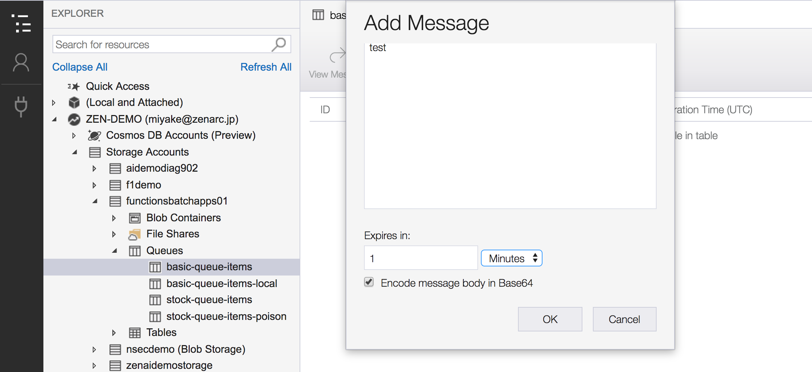

# Module03: Azure Storageのキュー操作

## 1. Azure Storage Explorer を使う

デスクトップアプリケーションである **Azure Storage Explorer** を使って、Azure Storageのキューを操作することができます。Windows、Linux、および MAC バージョンがサポートされています。

### インストール

[Azure Storage Explorer](https://azure.microsoft.com/en-us/features/storage-explorer/)のダウンロードページから各プラットフォーム用のインストーラをダウンロードしてインストールします。

### アカウント設定

Azure Storage Explorerを起動します。
[Manage Account] アイコン（人型アイコン）をクリックし、[Add an account] をクリックして、資格情報を入力します。

### キューを確認する

Azure Storage Explorerを使って、ストレージアカウントを展開し、[module01](module01.md)で作成したキューがあるかどうかを確認します。（例: basic-queue-items ）。

## 3. キュートリガーFunctionの動作確認

### Functionのローカル起動

Visual Studioの```funnctions-batchapps```ソリューションにある```BasicQueueTriggerApp```をスタートアッププロジェクトに設定します。

デバッグで起動します。```BasicQueueTrigger```クラスの```Run```メソッド内に適宜ブレイクポイントをいれておくとキュートリガー起動時の動きを確認できます。

### キューにメッセージを追加

Azure Storage Explorerを使って、キューにメッセージを追加します。



1. [対象のストレージアカウント] - [Queues] - [作成したキュー名] を選択し、ダブルクリックします。

1. [作成したキュー名]タブの [+ Add Message] ボタンをクリックします。

1. Add Messageダイアログに、任意の文字列を入力します。（例: "test"など）

    - 文字列はダブルクオーテーションで囲って下さい
    - Expireは**1 Minutes**などに変更します
    - [Encode message body in Base64] はチェックしたままにします

### Functionの動作を確認

ローカルで起動しているFunction App ```AajpFunctions``` にメッセージが到達していることを確認します。