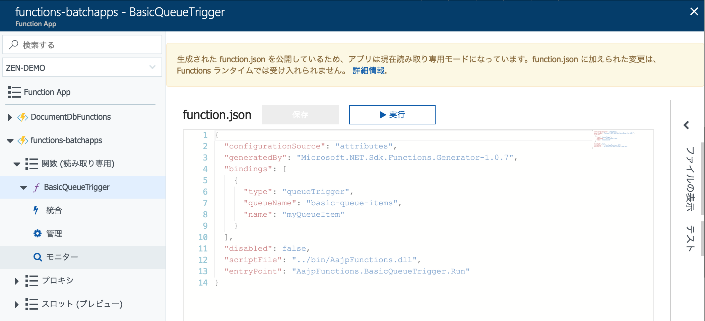
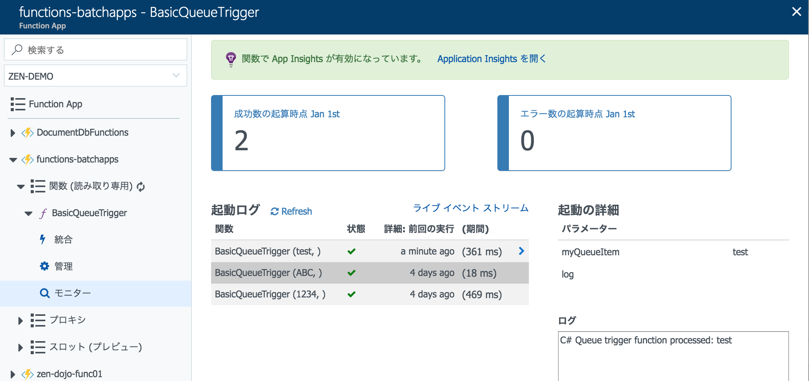

# Function App をデプロイする

## Visual Studio 2017を使ったデプロイ

1. Visual Studioでデプロイするソリューションを開きます。

1. デプロイするプロジェクト ```AajpFunctions``` を右クリックし > **[発行]** をクリックします。

1. 発行画面で **Azure Function App（Azure関数）**を選択し、 **[既存のものを選択]** を選んで、 **[発行]** をクリックします。

1. **[アカウントの追加]** をクリックし、Azure サブスクリプションにサインインします。 既にサインインしている場合は、目的のサブスクリプションを含んだアカウントをドロップダウンから選択します。

1. **[サブスクリプション]** を選択すると、先ほど作成したFunction Appを選択できるので、デプロイしたいWeb App名を選択（ **ここでプライマリとセカンダリのどちらかを選ぶ** ）した状態にして、 **[OK]** をクリックします。

1. デプロイが完了するまで数分待ちます。

    出力コンソールに ```Publish completed``` と表示されれば完了です。

## Visual Studio for Macを使ったデプロイ

Visual Studio for MacではGUIを使ったAzureへのFunctionデプロイがサポートされていないため、Function AppのCLIツールである[Azure Functions Core Tools]を使います。（ [module02](module02.md)でインストール済み ）

1. Visual Studio for Macでデプロイするソリューションを開きます。

1. Function Appプロジェクト ```AajpFunctions``` をビルドします

1. ターミナルで、 AajpFunctions / bin / Debug(Release) / net461 に移動して以下を実行します

```bash
$ func azure login
# コンソールの指示に従ってサインイン処理を行う

$ func azure account set d234eb8b-e2a2-4567-a0f6-579f01631743
$ func azure functionapp publish functions-batchapps
```

## ポータルでのデプロイ確認

1. Azureポータルの全体メニューで **Fanction App** をクリックし、[module01](module01.md)で作成したFunction Appを選択します。

    全体メニューに表示されない場合は、メニュー一番下「その他サービス」から探し、スターを付けておきます。

1. Function App画面で、該当のFunction App以下にある[関数]を展開して、[BasicQueueTrigger]というFunctionが表示されていればデプロイは完了しています。

    

## キューを使ってFunctionを起動する

[module03](module03.md)で実施したように、Azure Storage Explorerを使って、キューに再度メッセージを追加します。

> ローカルでのFunctionが実行されていないことを確認して下さい。

1. [対象のストレージアカウント] - [Queues] - [作成したキュー名] を選択し、ダブルクリックします。

1. [作成したキュー名]タブの [+ Add Message] ボタンをクリックします。

1. Add Messageダイアログに、任意の文字列を入力します。（例: testなど）

    - Expireは**1 Minutes**などに変更します
    - [Encode message body in Base64] はチェックしたままにします。

## デプロイしたFunctionの動作確認

1. Azureポータルの全体メニューで **Fanction App** をクリックし、[module01](module01.md)で作成したFunction Appを選択します。

1. Function App画面で、該当のFunction App以下にある[関数] - [BasicQueueTrigger]を展開します。

1. [モニター] をクリックして、Functionの実行結果を確認します。

    

    > 反映するまで数分時間をおく必要があります。定期的に [Refresh] をクリックして下さい。
