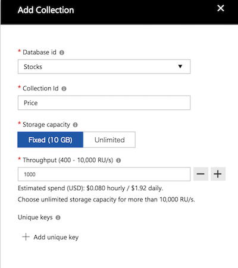

# Module05: Azure Cosmos DB の構築

## 1. Azure Cosmos DBアカウントの作成

1. Azureポータルにて、 **新規** > **Databases** > **Azure Cosmos DB** をクリックします。

1. **新規アカウント** 作成画面では以下を参考に設定して下さい。

    * ID: 任意の文字列（半角英数小文字とハイフンのみ）
    * API: **SQL** を選択
    * サブスクリプション: ハンズオン用に用意したサブスクリプション
    * リソースグループ: [module0](module0.md)で作成したリソースグループを選択（新規作成しない）
    * 場所: Function Appをデプロイした場所と同一
    * **Geo 冗長の有効化** のチェックはここでは外しておく

    **作成** をクリックします。

1. デプロイが完了するまで数分待ちます。

    画面右上の通知領域でデプロイ状況がわかりますので、データベースアカウントが作成できたことを確認します。

## 2. コレクションの作成

1. 全体メニューで **Azure Cosmos DB** をクリックし、作成したデータベースアカウントを選択します。

    全体メニューに表示されない場合は、メニュー一番下「その他サービス」から探し、スターを付けておきます。

1. **Azure Cosmos DB アカウント** ブレードにて、 **データエクスプローラー** > **New Collection** をクリックします。

1. Add Collection画面では以下のように設定して下さい。

    * Database id: **Stocks**
    * Collection id: **Price**
    * Storage capacity: **Fixed (10GB)** を選択
    * Throughput: **1000**

    大文字、小文字の使い分けは任意ですが、クライアントアプリケーションの設定値等にも影響しますので、注意して下さい。

    

1. **OK** をクリックします。

## 4. サンプルデータの追加

1. データエクスプローラーのCOLLECTIONペインにて、 **Stocks**データベース内の **Price**コレクションを展開し、**Documents**をクリックします。

1. **Documents** タブで、**New Document**をクリックします。

1. 以下を参考にJSONドキュメントを編集します。

    ```JSON
    {
        "ticker": "0001",
        "stockName": "サンプル1",
        "price": 500,
        "volume": 1000,
        "stockValue": 500000
    }
    ```

    ```id```はJSONで記述を省略すると自動で採番されます。値は任意の文字列を入れて構いません。

1. **Documents** タブで、**Save**アイコンをクリックします。

## 5. データの確認

1. 追加されたデータは、**Documents** タブのリストからidを選択して確認することができます。

    ```_rid```などアンダースコアから始まる項目は、Cosmos DBが内部で管理するデータです。

1. そのままJSONを編集し、**Save**アイコンをクリックすると、データを変更できます。

    管理項目は編集しないようにして下さい。

### (参考)　Azure Storage Explorer を使う

デスクトップアプリケーションである **Azure Storage Explorer** を使って、Azure Cosmos DBのデータを操作することができます（プレビュー）。

* 利用手順: [Azure Cosmos DB を Azure Storage Explorer で管理する (プレビュー)](https://docs.microsoft.com/ja-jp/azure/cosmos-db/tutorial-documentdb-and-mongodb-in-storage-explorer)

## 6. Cosmos DBの接続文字列を記録しておく

後続の作業で使うため、Cosmos DBの接続文字列を手元にメモしておきます。

1. **Azure Cosmos DB アカウント** ブレードにて、 **キー** を選択します。

1. **プライマリ接続文字列**をコピーします。

1. 手元のテキストファイル等に保存しておきます

---
[Back](module04.md) | [Next](module06.md)