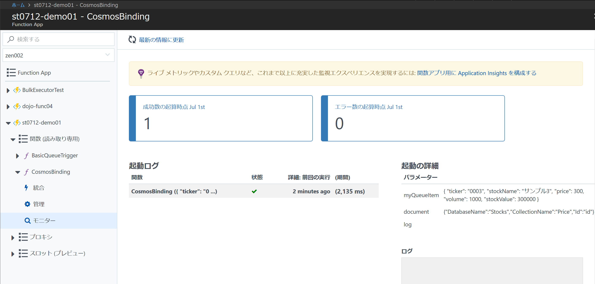

# Module07: Cosmos DB バインディングのFunctionを追加デプロイする

## Functionのデプロイ

このステップでは、既存のFunction App（[module04](module04.md)でデプロイしたFunction App）に関数を追加します。

## Visual Studio 2017を使ったデプロイ

1. Visual Studioでデプロイするソリューションを開きます。

1. デプロイするプロジェクト ```AajpFunctions``` を右クリックし > **[発行]** をクリックします。

1. デプロイが完了するまで数分待ちます。

    出力コンソールに ```Publish completed``` と表示されれば完了です。

## Visual Studio for Macを使ったデプロイ

Visual Studio for MacではGUIを使ったAzureへのFunctionデプロイがサポートされていないため、Function AppのCLIツールである[Azure Functions Core Tools]を使います。（ [module02](module02.md)でインストール済み ）

1. Visual Studio for Macでデプロイするソリューションを開きます。

1. Function Appプロジェクト ```AajpFunctions``` をビルドします

1. ターミナルで、 AajpFunctions / bin / Debug(Release) / net461 に移動して以下を実行します

```bash
$ func azure login
# コンソールの指示に従ってサインイン処理を行う

$ func azure account set d234eb8b-e2a2-4567-a0f6-579f01631743
$ func azure functionapp publish functions-batchapps
```

## ポータルでのデプロイ確認

1. Azureポータルの全体メニューで **Fanction App** をクリックし、デプロイしたFunction Appを選択します。

1. Function App画面で、該当のFunction App以下にある[関数]を展開して、追加したFunction（ ```CosmosBinding``` など）が表示されていればデプロイは完了しています。

## キューを使ってFunctionを起動する

[module06](module06.md)で実施したように、Azure Storage Explorerを使って、キューに再度メッセージを追加します。

> ローカルでFunctionがデバッグ実行されていないことを確認して下さい。

1. [対象のストレージアカウント] - [Queues] - [キュー名] を選択し、ダブルクリックします。

    * キューは、module06で作成したキュー名( ```stock-queue-items``` など)を選択します

1. [キュー名]タブの [+ Add Message] ボタンをクリックします。

1. Add Messageダイアログに、以下のJSON文字列を入力します。

    ```json
    {
        "ticker": "0003",
        "stockName": "サンプル3",
        "price": 300,
        "volume": 1000,
        "stockValue": 300000
    }
    ```

    - Expireは**1 Minutes**などに変更します
    - [Encode message body in Base64] はチェックしたままにします。

## デプロイしたFunctionの動作確認

1. Function App画面で、該当のFunction App以下にある[関数] - [追加したFunction名（ ```CosmosBinding``` など）]を展開します。

1. [モニター] をクリックして、Functionの実行結果を確認します。

    

    > 反映するまで数分時間をおく必要があります。定期的に [Refresh] をクリックして下さい。
