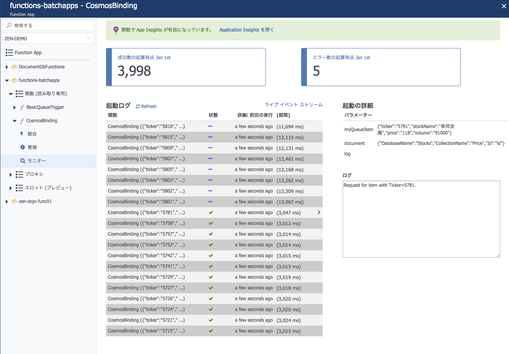

# Module08: キューに大量のメッセージを発行してFunctionの並列処理を実行する

## 1. キュー発行プロジェクト(C#)の設定

1. Visual Studioでソリューションファイル```funnctions-batchapps.sln```を開きます。

1. ```StockQueueCreator``` プロジェクトを右クリックし、スタートアッププロジェクトとして設定します。

1. ```StockQueueCreator``` プロジェクト以下の ```Program.cs``` を編集できるように開きます。

1. コード内の以下文字列をそれぞれ変更します。

    * ```{YOUR STORAGE CONNECTION STRING}```: [module01](module01.md)でメモしておいたストレージアカウントの接続文字列
    * ```{YOUR QUEUE NAME}```: [module06](module06.md)で設定したキュー名（ ```stock-queue-items``` など）

    > 本来、ソースコード内に直接接続文字列を記述することは望ましくありません。

## 2. 大量メッセージの発行

1. ```StockQueueCreator``` プロジェクトをビルドします。

1. ```StockQueueCreator``` プロジェクトをデバッグ実行します。

1. コンソールに実行状況が表示されていることを確認します。

    > 約3,500件のメッセージが発行されます。

    ```bash
    Start enqueue
    ...
    Ticker: 1726, Price: 253
    Ticker: 1728, Price: 268
    Ticker: 1730, Price: 345
    Ticker: 1734, Price: 369
    Ticker: 1736, Price: 1151
    ...
    Completed enqueue
    ```

    * Completedは待たずに次のステップに進んで構いません。

## 3. 処理状況の確認

1. Cosmos DBのデータエクスプローラーで、データ件数をカウントします。

    ```sql
    SELECT count(1) FROM c
    ```

1. Function Appのモニターで起動ログを確認します。

    


> 全ての処理（約3,500件のバッチ処理実行）に約20分程度かかるように調整しています。