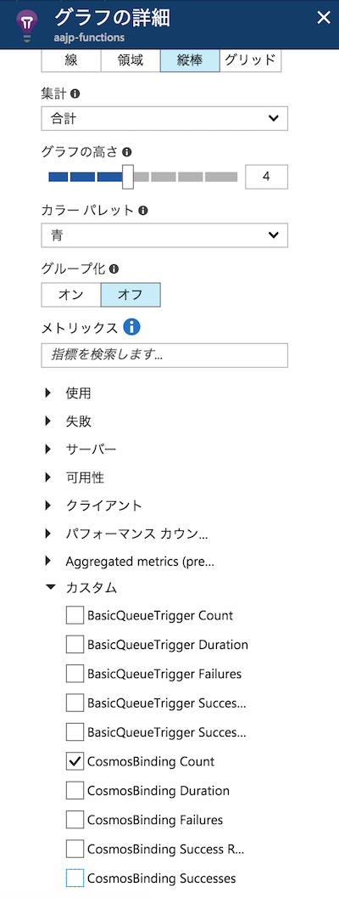
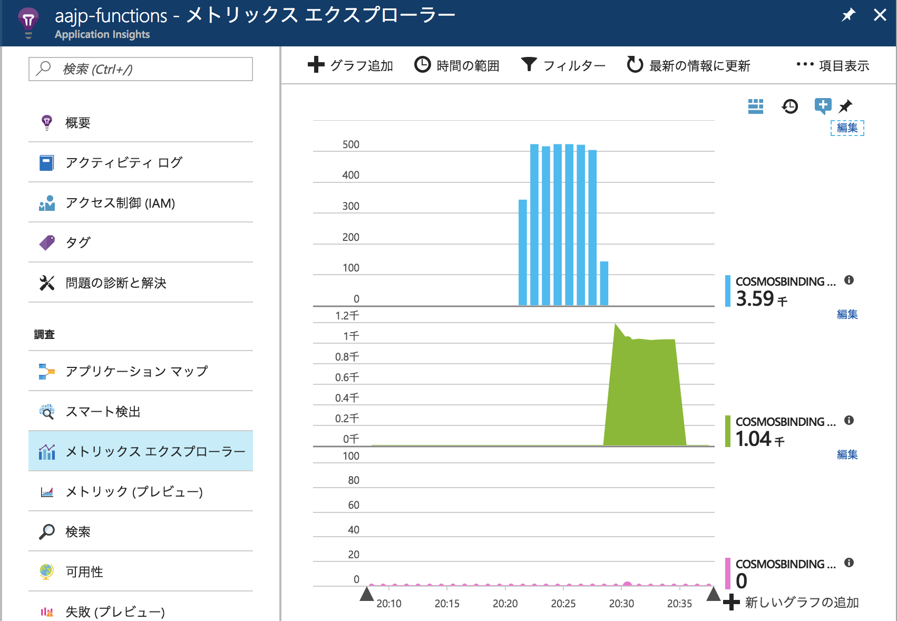

# Module09: Application Insights でFunction Appを監視する

## 1. Function App で Application Insights を有効にする

* 公式ガイド: [Azure Functions を監視する](https://docs.microsoft.com/ja-jp/azure/azure-functions/functions-monitoring)

### Application Insights インスタンスの作成

1. Azureポータルにて、 **+新規** > **Monitoring + Management** > **Application Insights** をクリックします。

1. **Application Insights** の作成画面では以下を参考に設定して下さい。

    * 名前: 任意の文字列（半角英数小文字とハイフンのみ）
    * アプリケーションの種類: **全般**
    * サブスクリプション: ハンズオン用に用意したサブスクリプション
    * リソースグループ: [module00](module00.md)で作成したリソースグループを選択（新規作成しない）
    * 場所: 任意の場所（日本リージョン無し）

    **作成** をクリックします。

1. デプロイが完了するまで数分待ちます。

    画面右上の通知領域でデプロイ状況がわかりますので、Application Insightsが作成できたことを確認します。

1. [概要] ページから **インストルメンテーション キー** をコピーします。

### Function App と Application Insights の紐付け

1. Azureポータルの全体メニューで **Fanction App** をクリックし、デプロイしたFunction Appを選択します。

1. Function App画面で、該当のFunction App名のルートをクリックします。

1. 構成済みの機能欄にある [アプリケーション設定] リンクをクリックします。

1. アプリケーション設定タブの **[アプリケーション設定]** で以下のようキーと値を追加して下さい。

    * キー: APPINSIGHTS_INSTRUMENTATIONKEY
    * 値: xxxxxxxxxx-xxxx-xxxx-xxxx-xxxxxxxxxxx

    > 値には、 前のステップでコピーしたインストルメンテーション キーを入れて下さい。

1. アプリケーション設定タブ上部の **保存** アイコンをクリックします。

## 2. Application Insights で Function App の実行状況を確認する

1. [module08](module08.md) の手順で再度メッセージを発行します。

1. ポータルのFunction App画面で、該当のFunction App名のルートをクリックします。

1. 構成済みの機能欄にある [Application Insights] リンクをクリックします。

1. **検索** を選択すると、Functionの実行ログを確認することができます。

1. **メトリックス エクスプローラー** を選択すると、メトリックをグラフ化することができます。Function App では主に以下のメトリックを使います。

    * Function実行件数: カスタム / [Function名] Count (集計単位: 合計)
    * Function実行時間: カスタム / [Function名] Duration (集計単位: 平均)
    * Functionエラー件数: カスタム / [Function名] Failures (集計単位: 合計)
    

1. グラフを設定すると以下のように確認することができます。

    

## Op. 組み込みのログを無効にする

組み込みログはAzure Storageにテレメトリを保存する仕組みのため、高負荷なFunction Appでは無効化することが推奨されています。

1. Function App画面で、該当のFunction App名のルートをクリックします。

1. 構成済みの機能欄にある [アプリケーション設定] リンクをクリックします。

1. アプリケーション設定タブの **[アプリケーション設定]** で以下のキーを削除ます。

    * AzureWebJobsDashboard

    > 組み込みログを削除すると、Function Appのモニター画面にはログが表示されなくなります。

---
[Back](module08.md) | [Next](module10.md)