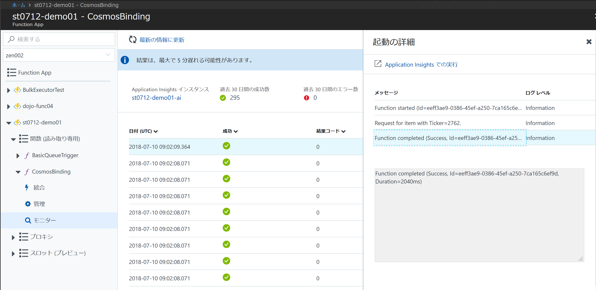
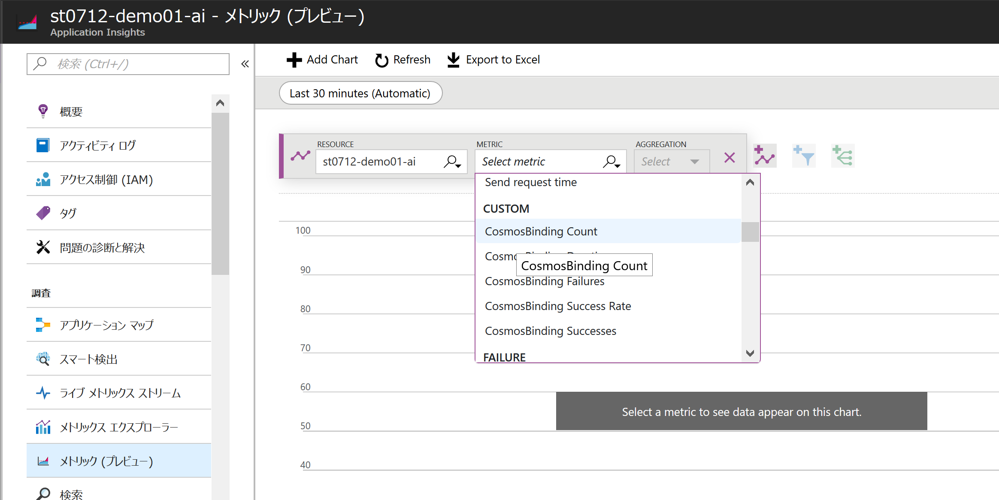
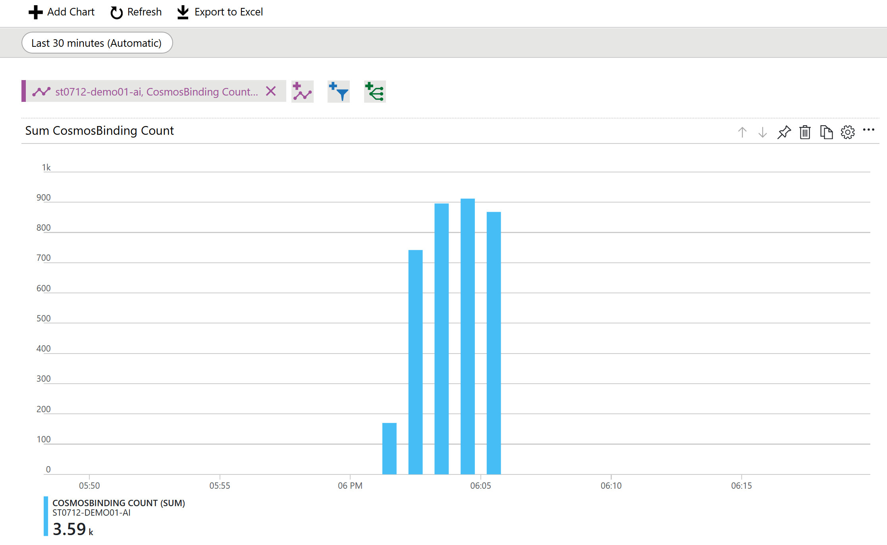

# Module09: Application Insights でFunction Appを監視する

## 1. Function App で Application Insights を有効にする

* 公式ガイド: [Azure Functions を監視する](https://docs.microsoft.com/ja-jp/azure/azure-functions/functions-monitoring)

### Application Insights の構成

1. Function App画面で、該当のFunction App以下にある[関数] - [追加したFunction名（ `CosmosBinding` など）]を展開します。

1. [モニター] をクリックして、以下のいずれかのアクションを実行します。

    * クラシック表示のモニター画面が表示されている場合は、 **[関数アプリ用に Application Insights を構成する]** リンクをクリック
    * 起動ログをキャプチャするための Application Insights の構成画面が表示されいる場合は、 **[構成]** ボタンをクリック

1. **Application Insights** の作成画面が表示されたら、以下を参考に設定して下さい。

    * [新しいリソースの作成] を選択する
    * 新しいリソースの名前: 任意の文字列（半角英数小文字とハイフンのみ）
    * 場所: 任意の場所（日本リージョンはないので、適当なリージョンを選択）

1. [OK] をクリックして数分待ちます。

1. Function App画面に戻り、該当のFunction App以下にある[関数] - [追加したFunction名（ `CosmosBinding` など）]を展開します。

1. [モニター] をクリックします。

1. モニター画面のデザインが変更されていることを確認します。

    > この段階では、過去に実行した結果は反映されていません

## 2. Application Insights で Function App の実行状況を確認する

### Function App のモニター画面で実行結果を確認する

1. [module08](module08.md) の手順で再度メッセージを大量に発行します。

1. 実行が完了したら、ポータルのFunction App画面に戻り、該当のFunction App以下にある[関数] - [実行したFunction名（ `CosmosBinding` など）]を展開します。

1. [モニター] 画面で実行結果を確認します。

    
    > 反映するまで数分時間をおく必要があります。定期的に [最新の情報に更新] をクリックして下さい。

### Application Insightsで実行結果やログを詳細に分析する

1. [モニター] 画面の [Application Insights インスタンス] 下にあるリソース名のリンクをクリックします。

1. 画面上部に紫のアラートが表示されたらクリックして、Application Insights ブレードに遷移します

1. [概要] メニュー > 画面上部の **検索** を選択すると、Functionの実行ログを確認することができます。

1. **メトリック（プレビュー）** を選択すると、メトリックをグラフ化することができます。Function App では主に以下のメトリックを使います。

    * Function実行件数: CUSTOM > [Function名] Count (AGGREGATION: Sum)
    * Function実行時間: CUSTOM > [Function名] Duration (AGGREGATION: Avg)
    * Functionエラー件数: CUSTOM > [Function名] Failures (AGGREGATION: Sum)
    

1. グラフを設定すると以下のように確認することができます。

    

## Op. 組み込みのログを無効にする

組み込みログはAzure Storageにテレメトリを保存する仕組みのため、高負荷なFunction Appでは無効化することが推奨されています。

1. Function App画面で、該当のFunction App名のルートをクリックします。

1. 構成済みの機能欄にある [アプリケーション設定] リンクをクリックします。

1. アプリケーション設定タブの **[アプリケーション設定]** で以下のキーを削除します。

    * AzureWebJobsDashboard

    > 組み込みログを削除すると、Function Appのモニター画面にはログが表示されなくなります。

---
[Back](module08.md) | [Next](module10.md)