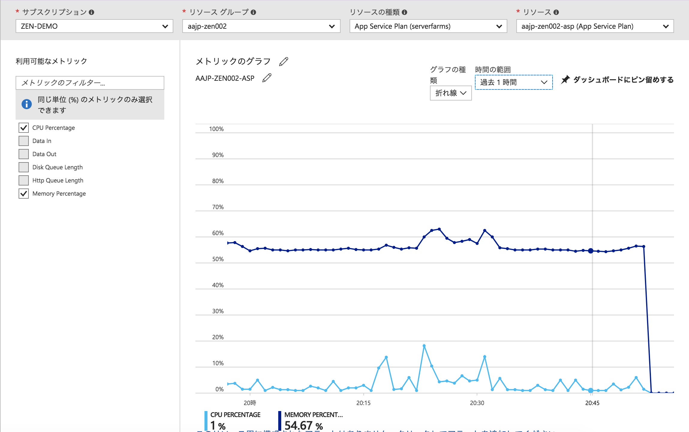
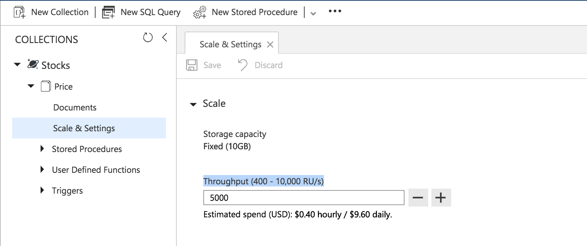

# Module10: Azure Monitor でバッチ処理の処理状況を分析する

## 1. Function App のインスタンス負荷

### Azure Monitor での App Service 負荷分析

1. Azureポータルの全体メニューで **モニター** をクリックします。

    全体メニューに表示されない場合は、メニュー一番下「その他サービス」から探し、スターを付けておきます。

1. **モニター**ブレードで、 **メトリック** を選択します。

1. フィルタを以下のように設定し、Function App が動いているApp ServiceインスタンスのCPUとメモリ使用状況を分析します。

    * サブスクリプション: ハンズオン用に用意したサブスクリプション
    * リソースグループ: [module00](module00.md)で作成したリソースグループを選択（新規作成しない）
    * リソースの種類: App Service Plan (serverfarms)
    * リソース: Function App がデプロイされているApp Service名

    

### 同時実行数の調整

CPUとメモリに余裕がある場合は、まず1インスタンス内での Function 同時実行数を増やします。

1. ```AajpFunctions```プロジェクト内の```host.json```を開き、以下のようにキュートリガーの同時実行数を設定します（デフォルト: 16, 最大: 32）

    ```json
    {
        "queues": {
            "batchSize": 32
        }
    }
    ```

1. Function App を再度デプロイします。

1. 再度メッセージを発行しバッチ処理を実行します。

1. Azure MonitorでCPUとメモリの利用率が上昇しているかどうかを確認します。

### App Service のスケールアウト

CPUとメモリに余裕がない場合でさらに並列度を上げるには、App Serviceインスタンスをスケールアウトします。

1. Azureポータルの全体メニューで **Fanction App** をクリックし、デプロイしたFunction Appを選択します。

1. Function App画面で、該当のFunction App名のルートをクリックします。

1. [プラットフォーム機能] タブを選択し、[すべての設定] リンクをクリックします。

1. App Service 画面で、[設定] - [スケールアウト(App Service のプラン)] をクリックします。

1. 構成タブで **[インスタンス数]** を任意の数に増やします。

    > * 増やした分だけ、App Serviceの利用量が増えます。
    > * オートスケール設定も可能です

1. 再度メッセージを発行しバッチ処理を実行します。

1. Application Insights のメトリックスエクスプローラーでバッチ処理全体の実行時間が短縮しているかどうかを分析します。

    > 実行時間が短縮しない場合は、インスタンスを十分に活用できていないので（キューの追加処理がApp Serviceの処理量に追いついていない等）、スケールの設定を戻します。

## 2. Cosmos DB のスループット調整

Function App の同時処理数を増やしていくと、データベースの負荷が上昇します。Cosmos DB の場合は予約したスループットを超過すると、スロットリングが発生してキューが処理されなくなる可能性があるため、スループットを分析して必要に応じて調整します。

### Azure Monitor での Cosmos DB 負荷分析

1. Azureポータルの全体メニューで **モニター** をクリックします。

1. **モニター**ブレードで、 **メトリック** を選択します。

1. フィルタを以下のように設定し、Function App が出力している Cosmos DB のスループットとスロットリング状況を分析します。

    * サブスクリプション: ハンズオン用に用意したサブスクリプション
    * リソースグループ: [module00](module00.md)で作成したリソースグループを選択（新規作成しない）
    * リソースの種類: Database Account (databaseAccounts)
    * リソース: Cosmos DB のアカウント名

    選択するメトリック

    * Max RUs Per Second
    * Throttled Requests

### Cosmos DB のスケールアウト

1. Azureポータルの全体メニューで **Azure Cosmos DB** をクリックし、対象のデータベースアカウントを選択します。

1. **Azure Cosmos DB アカウント** ブレードにて、 **データエクスプローラー** > **データベース名** > **コレクション名** を展開します。

1. [Scale & Settings] をクリックし、[Throughput (400 - 10,000 RU/s)]の値を増やします。

    

1. タブ上部の [Save] アイコンをクリックして反映させます。

1. 再度メッセージを発行しバッチ処理を実行します。

1. Azure Monitor の Cosmos DB メトリックを確認して、 [Max RUs Per Second] が予約したスループットを超えていないことを確認します。

1. スループットに余裕がある場合は、再度スループットを調整し、コストを最適化します。

---
[Back](module09.md) | [Top](README.md)